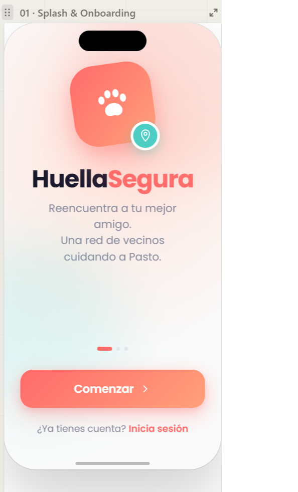
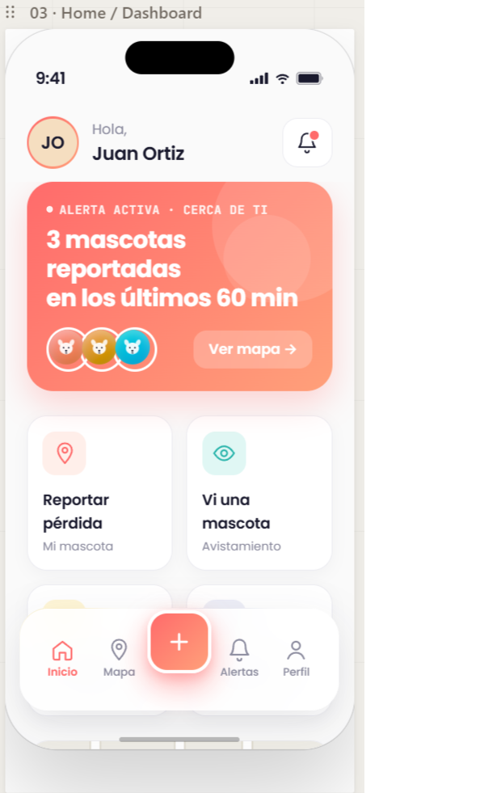
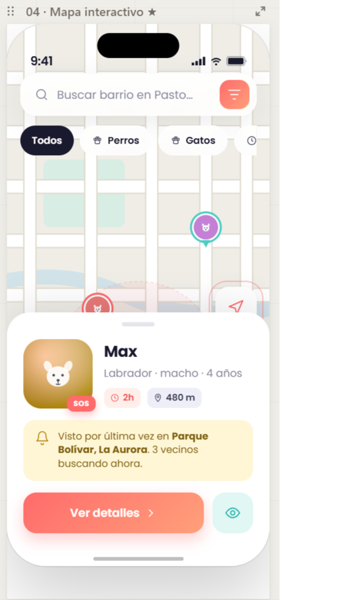
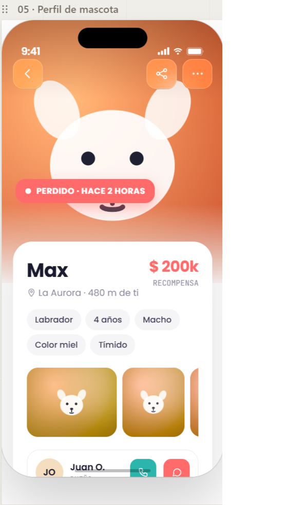
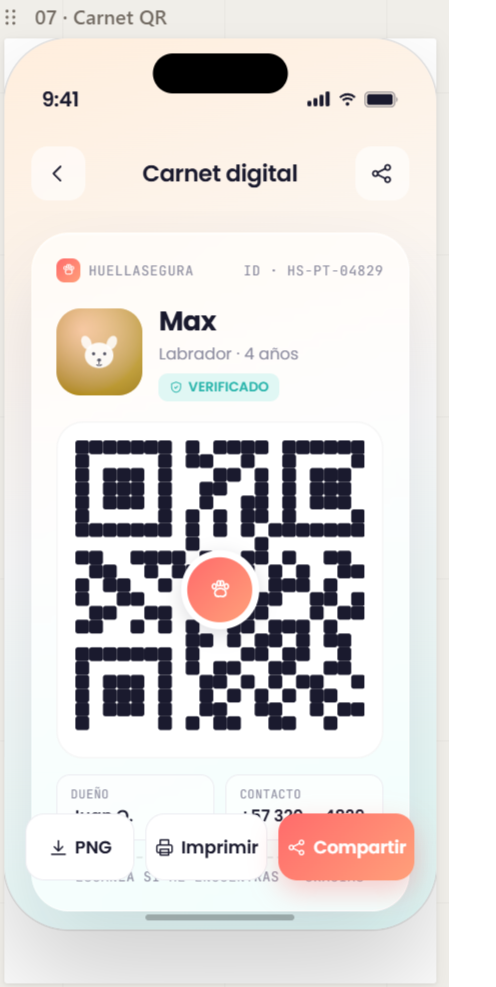
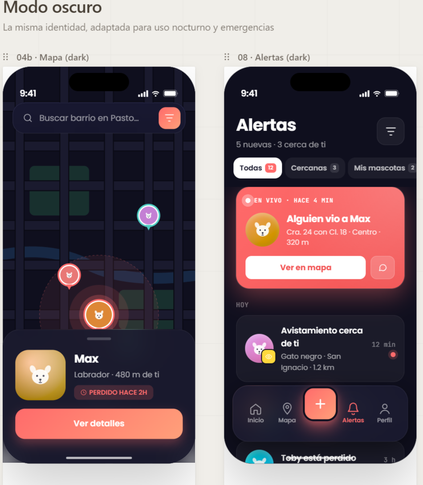
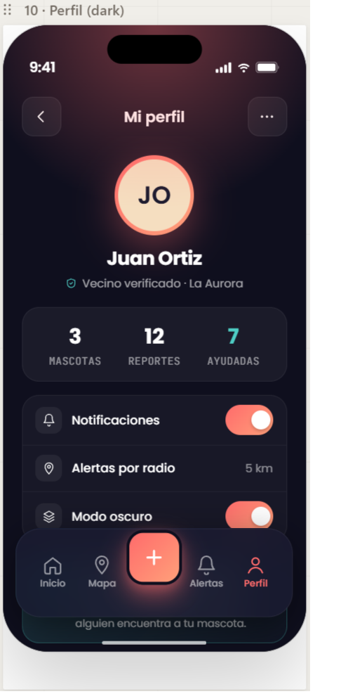
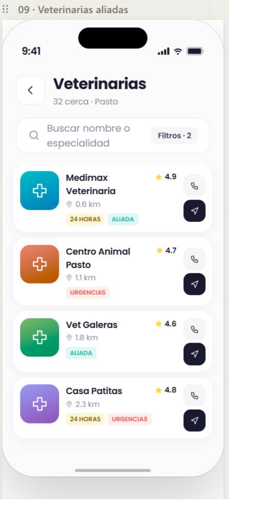

<h1 align="center">
  <br>
  🐾 HuellaSegura
  <br>
</h1>

<h4 align="center">Plataforma web para la búsqueda y recuperación de mascotas perdidas</h4>

<p align="center">
  
  
  
  
  
</p>

<p align="center">
  <a href="#caracteristicas">Características</a> •
  <a href="#tecnologias">Tecnologías</a> •
  <a href="#instalacion">Instalación</a> •
  <a href="#uso">Uso</a> •
  <a href="#estructura">Estructura</a> •
  <a href="#pruebas">Pruebas</a>
</p>

---

## Vista previa

<table>
  <tr>
    <td></td>
    <td></td>
    <td></td>
    <td></td>
  </tr>
  <tr>
    <td align="center">Splash</td>
    <td align="center">Inicio</td>
    <td align="center">Mapa de reportes</td>
    <td align="center">Perfil de mascota</td>
  </tr>
  <tr>
    <td></td>
    <td></td>
    <td></td>
    <td></td>
  </tr>
  <tr>
    <td align="center">Carnet QR</td>
    <td align="center">Alertas</td>
    <td align="center">Perfil de usuario</td>
    <td align="center">Directorio aliados</td>
  </tr>
</table>

---

## Características

- **Registro de mascotas** — Crea el perfil de tu mascota con fotos, descripción y datos médicos
- **Reportes de perdida/encuentro** — Publica reportes geolocalizados cuando pierdas o encuentres una mascota
- **Mapa interactivo** — Visualiza todos los reportes y avistamientos en un mapa en tiempo real
- **Código QR personal** — Genera un QR único por mascota que lleva a su perfil público con tus datos de contacto
- **Carnet digital** — Carnet imprimible con foto, datos y QR de la mascota
- **Avistamientos** — Reporta si viste una mascota perdida con ubicación exacta
- **Notificaciones automáticas** — Recibe alertas por email cuando alguien reporte un avistamiento cercano
- **Directorio de aliados** — Encuentra veterinarias y refugios asociados cerca de ti
- **Panel de administración** — Moderación de reportes y gestión de usuarios
- **Perfil público** — Comparte el perfil de tu mascota sin necesidad de cuenta

---

## Tecnologías

### Backend
| Tecnología | Uso |
|---|---|
| Node.js + Express | Servidor y API REST |
| Sequelize + MySQL | ORM y base de datos |
| JWT (jsonwebtoken) | Autenticación stateless |
| Cloudinary | Almacenamiento de imágenes |
| Nodemailer | Envío de correos de alerta |
| QRCode | Generación de códigos QR |
| PDFKit | Exportación de carnets en PDF |
| Multer | Subida de archivos |

### Frontend
| Tecnología | Uso |
|---|---|
| React 18 + Vite | Framework de UI y bundler |
| TailwindCSS | Estilos utilitarios |
| React Router v6 | Navegación SPA |
| Leaflet + React Leaflet | Mapas interactivos |
| React Hook Form + Zod | Formularios y validación |
| Framer Motion | Animaciones de transición |
| Axios | Peticiones HTTP |
| qrcode.react | Renderizado de QR en UI |
| Sonner | Notificaciones toast |

### Testing
| Herramienta | Uso |
|---|---|
| Jest + Supertest | Pruebas unitarias e integración del backend |
| Vitest + Testing Library | Pruebas unitarias del frontend |

---

## Instalación

### Requisitos previos
- Node.js 18+
- MySQL 8+
- Cuenta en [Cloudinary](https://cloudinary.com) (gratuita)
- Cuenta de Gmail con [contraseña de aplicación](https://support.google.com/accounts/answer/185833)

### 1. Clonar el repositorio

```bash
git clone https://github.com/VictorRosas69/HuellaSegura.git
cd HuellaSegura
```

### 2. Configurar el backend

```bash
cd backend
npm install
cp .env.example .env
```

Edita el archivo `.env` con tus credenciales:

```env
PORT=3001
NODE_ENV=development

DB_HOST=localhost
DB_PORT=3306
DB_NAME=huella_segura
DB_USER=root
DB_PASSWORD=tu_contraseña_mysql

JWT_SECRET=un_secreto_muy_largo_y_seguro_minimo_32_caracteres
JWT_EXPIRES_IN=24h

CLOUDINARY_CLOUD_NAME=tu_cloud_name
CLOUDINARY_API_KEY=tu_api_key
CLOUDINARY_API_SECRET=tu_api_secret

EMAIL_HOST=smtp.gmail.com
EMAIL_PORT=587
EMAIL_USER=tucorreo@gmail.com
EMAIL_PASS=tu_contraseña_de_aplicacion

FRONTEND_URL=http://localhost:5173
```

### 3. Crear la base de datos y ejecutar migraciones

```bash
# Crear la base de datos en MySQL
mysql -u root -p -e "CREATE DATABASE huella_segura;"

# Ejecutar migraciones
npx sequelize-cli db:migrate
```

### 4. Configurar el frontend

```bash
cd ../frontend
npm install
cp .env.example .env
```

Edita `frontend/.env`:

```env
VITE_API_URL=http://localhost:3001/api
```

---

## Uso

### Iniciar en desarrollo

Desde la raíz del proyecto, abre dos terminales:

**Terminal 1 — Backend:**
```bash
cd backend
npm run dev
```

**Terminal 2 — Frontend:**
```bash
cd frontend
npm run dev
```

La aplicación estará disponible en:
- Frontend: [http://localhost:5173](http://localhost:5173)
- API: [http://localhost:3001/api](http://localhost:3001/api)

### Iniciar en producción

```bash
# Backend
cd backend && npm start

# Frontend
cd frontend && npm run build && npm run preview
```

---

## Estructura del proyecto

```
HuellaSegura/
├── backend/
│   ├── migrations/          # Migraciones de base de datos
│   ├── seeders/             # Datos de prueba
│   ├── src/
│   │   ├── config/          # BD, JWT, Cloudinary
│   │   ├── controllers/     # Lógica de negocio
│   │   ├── middlewares/     # Auth, admin, upload, errores
│   │   ├── models/          # Modelos Sequelize
│   │   ├── routes/          # Definición de endpoints
│   │   └── services/        # Email, QR, PDF, distancias
│   ├── tests/
│   │   ├── unit/            # Pruebas unitarias
│   │   └── integration/     # Pruebas de integración
│   └── server.js
│
├── frontend/
│   ├── src/
│   │   ├── components/      # Componentes reutilizables
│   │   │   └── ui/          # Sistema de diseño base
│   │   ├── context/         # AuthContext
│   │   ├── hooks/           # useGeolocalizacion, useTheme
│   │   ├── pages/           # Vistas de la aplicación
│   │   │   └── admin/       # Panel de administración
│   │   ├── providers/       # ThemeProvider
│   │   └── services/        # Comunicación con la API
│   └── tests/
│       └── unit/            # Pruebas de componentes
│
└── docs/
    ├── DESIGN_SYSTEM.md     # Sistema de diseño
    └── desing/              # Mockups de interfaz
```

### Endpoints principales de la API

| Método | Ruta | Descripción |
|---|---|---|
| `POST` | `/api/auth/register` | Registro de usuario |
| `POST` | `/api/auth/login` | Inicio de sesión |
| `GET` | `/api/mascotas` | Listar mascotas del usuario |
| `POST` | `/api/mascotas` | Registrar mascota |
| `GET` | `/api/reportes` | Listar reportes activos |
| `POST` | `/api/reportes` | Crear reporte de pérdida |
| `GET` | `/api/avistamientos` | Listar avistamientos |
| `POST` | `/api/avistamientos` | Registrar avistamiento |
| `GET` | `/api/notificaciones` | Notificaciones del usuario |
| `GET` | `/api/publico/:uuid` | Perfil público de mascota (sin auth) |
| `GET` | `/api/entidades` | Directorio de entidades aliadas |

---

## Pruebas

### Backend

```bash
cd backend

# Pruebas unitarias
npm test

# Pruebas con coverage
npm run test:coverage

# Solo pruebas de integración
npm run test:integration
```

### Frontend

```bash
cd frontend

# Pruebas unitarias
npm test

# Pruebas con interfaz visual
npm run test:ui

# Coverage
npm run test:coverage
```

---

## Variables de entorno

| Variable | Descripción | Requerida |
|---|---|---|
| `PORT` | Puerto del servidor | No (default: 3001) |
| `DB_HOST` | Host de MySQL | Sí |
| `DB_NAME` | Nombre de la base de datos | Sí |
| `DB_USER` | Usuario de MySQL | Sí |
| `DB_PASSWORD` | Contraseña de MySQL | Sí |
| `JWT_SECRET` | Secreto para firmar tokens | Sí |
| `CLOUDINARY_CLOUD_NAME` | Nombre del cloud en Cloudinary | Sí |
| `CLOUDINARY_API_KEY` | API Key de Cloudinary | Sí |
| `CLOUDINARY_API_SECRET` | API Secret de Cloudinary | Sí |
| `EMAIL_USER` | Correo para envío de alertas | Sí |
| `EMAIL_PASS` | Contraseña de aplicación Gmail | Sí |
| `FRONTEND_URL` | URL del frontend (para CORS) | Sí |

---

## Autor

**Victor Rosas**
- GitHub: [@VictorRosas69](https://github.com/VictorRosas69)

---

<p align="center">Hecho con ❤️ para ayudar a reunir mascotas con sus familias</p>
